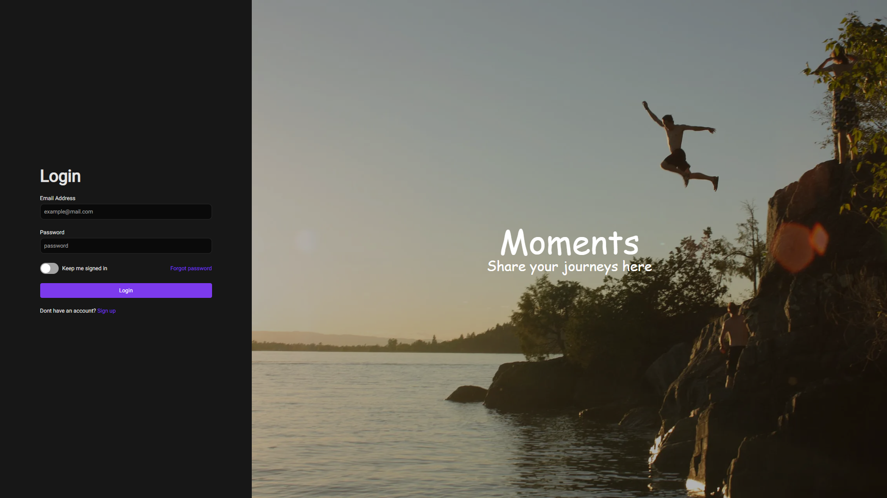

# MySocialApp

MySocialApp is a social media platform that allows users to connect, share, and interact with each other. This application is built using Next.js for the frontend, Express for the backend, Firebase Storage for file storage, and MongoDB as the database. (More screenshots can be found in the screenshots folder)



## Features

- **User Authentication:** Secure user registration and login functionality.
- **Profile Management:** Users can update their profiles and avatars.
- **Posts:** Users can create, edit, and delete posts.
- **Comments:** Users can comment on posts.
- **Image Upload:** Upload and store images using Firebase Storage.
- **Real-Time Messages:** Real-time updates when you message a user.
- **Follow System:** Users can follow and be followed by other users.
- **Search:** Search for users and posts.
- **Responsive Design:** A mobile-friendly and responsive user interface.

## Technologies Used

- **Frontend:** Next.js, React, Tailwind CSS.
- **Backend:** Express.js, WebSocket for real-time messages.
- **Database:** MongoDB for storing user data and posts.
- **Storage:** Firebase Storage for image uploads.
- **Authentication:** JWT for authentication.

## Getting Started

Follow these steps to get the project up and running on your local machine:

1. **Clone the repository:**

    ```bash
    git clone https://github.com/yourusername/mysocialapp.git
    cd mysocialapp
    ```

2. **Install dependencies:**

    ```bash
    cd frontend
    npm install
    cd ../backend
    npm install
    ```

3. **Set up Firebase:**

    - Create a Firebase project and obtain your Firebase configuration.
    - Set the Firebase configuration in `server/src/config/firebase.ts`.
    - You can store the config in a .env file.

4. **Set up MongoDB:**

    - Make sure you have MongoDB installed and running.
    - Set the MongoDB connection URI in `server/src/config/mongodb.ts`.
    - You can store the config in a .env file

5. **Start the development servers:**

    ```bash
    cd frontend
    npm run dev
    cd ../backend
    npm run dev
    ```

6. **Visit the app:**

   - Open your web browser and go to `http://localhost:3000` to see the app in action.
   - username: usertest@gmail.com
   - password: Usertest123

## Deployment

The frontend has been deployed to vercel while the backend has been deployed to railway

## License

This project is licensed under the MIT License - see the [LICENSE](LICENSE) file for details.

## Acknowledgments

- Special thanks to the open-source community for their valuable contributions.
- Inspired by various social media platforms.
Demo: [Moments](https://www.momentswelive.app/login)
